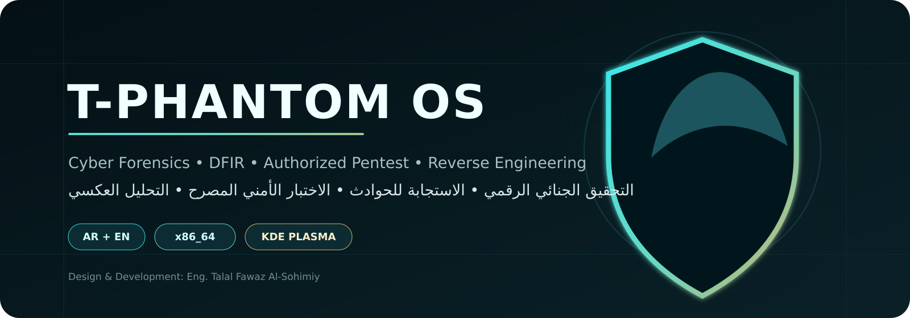
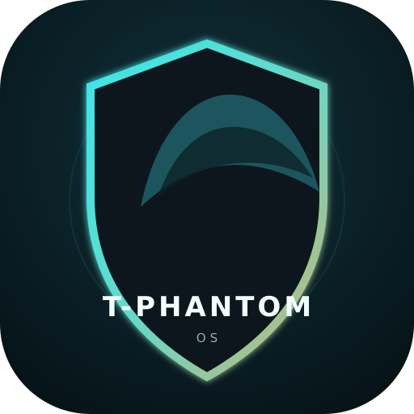
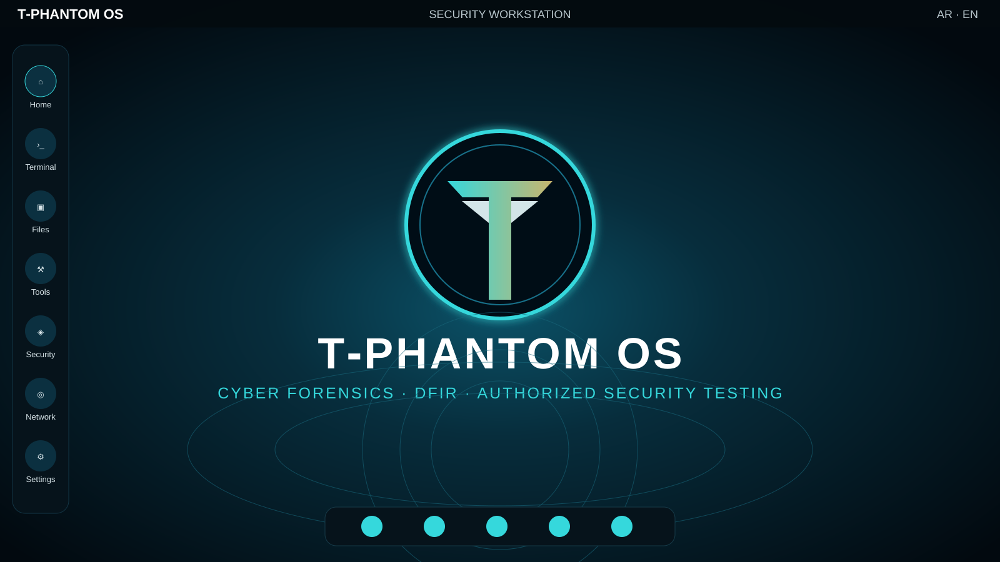
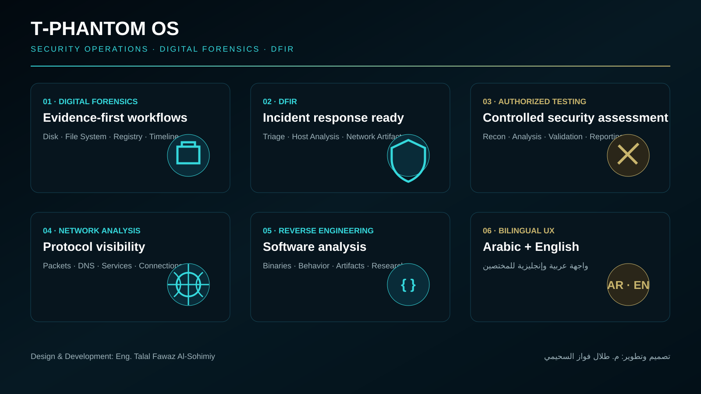

<div align="center">



<br>



# T‑PHANTOM OS

### Cyber Forensics · DFIR · Authorized Penetration Testing · Reverse Engineering · Privacy

**نظام تشغيل أمني عربي/إنجليزي للتحقيق الجنائي الرقمي، الاستجابة للحوادث، الاختبار الأمني المصرح، التحليل العكسي والخصوصية.**

[](#release-53)
[](#system-requirements)
[](#desktop--identity)
[](#bilingual-by-design)
[](#integrity)

[](https://sourceforge.net/projects/t-phantom-os/files/T-PHANTOM-OS-5.3/T-PHANTOM.iso/download)
[](https://drive.google.com/file/d/1naFZI6lveSYTdfP-UqyewSRyHx8tuEIF/view?usp=sharing)
[](https://talalsuhaimi.com)

**[English](#english) · [العربية](#العربية) · [Download](#download) · [Security](SECURITY.md) · [Roadmap](ROADMAP.md)**

</div>

---

## Visual Preview

<div align="center">



<br><br>



</div>

> Repository visuals are presentation assets. Release qualification and tested behavior are documented separately so artwork is not confused with test evidence.

---

## Download

### Primary distribution — SourceForge

**T‑PHANTOM OS 5.3**  
**File:** `T-PHANTOM.iso`  
**Architecture:** x86_64 / amd64  
**Size:** approximately 4.1 GB  
**Desktop:** KDE Plasma  
**Languages:** Arabic + English

**Primary download:**  
https://sourceforge.net/projects/t-phantom-os/files/T-PHANTOM-OS-5.3/T-PHANTOM.iso/download

**SourceForge project:**  
https://sourceforge.net/projects/t-phantom-os/

**Secondary mirror — Google Drive:**  
https://drive.google.com/file/d/1naFZI6lveSYTdfP-UqyewSRyHx8tuEIF/view?usp=sharing

See [`DOWNLOAD.md`](DOWNLOAD.md) for verification instructions.

### Integrity

Official SHA‑256:

```text
86ed41941fcaaaafbf9042e9ea18f45b623c51a073cef461234ef7ff76f4d51a  T-PHANTOM.iso
```

Verify on Linux:

```bash
sha256sum T-PHANTOM.iso
```

> **Security rule:** Do not boot or install an ISO whose SHA‑256 does not exactly match the value above.

---

## English

### What is T‑PHANTOM OS?

T‑PHANTOM OS is a Saudi-developed, security-focused Linux distribution for practical cybersecurity and digital-investigation workflows. It provides a bilingual Arabic/English environment for **DFIR, digital forensics, authorized penetration testing, incident response, reverse engineering, network analysis, security research, and privacy-oriented work**.

The goal is a coherent security workstation with an intentional identity, organized workflows, release validation, and clear documentation rather than an unstructured collection of tools.

### Upstream transparency

T‑PHANTOM OS is developed on top of Linux and uses upstream components from the Debian/Kali and KDE ecosystems. The project does **not** claim authorship over Linux, Debian, Kali Linux, KDE Plasma, or third-party security tools. T‑PHANTOM-specific work covers distribution engineering, build and integration, product identity, bilingual UX, workflow organization, validation, documentation, and project-created components. See [`NOTICE.md`](NOTICE.md).

### Core focus

| Area | Purpose |
|---|---|
| **DFIR** | Incident response, evidence handling, host and artifact analysis |
| **Digital Forensics** | Disk, file-system, timeline and artifact investigation |
| **Authorized Pentesting** | Security assessment where explicit authorization exists |
| **Reverse Engineering** | Binary and software-analysis workflows |
| **Network Analysis** | Packet, protocol, DNS and network-security investigation |
| **Security Research** | Controlled research, training labs and CTF environments |
| **Bilingual UX** | Arabic and English for regional and international use |

### Designed for

Digital-forensics investigators, DFIR and incident-response teams, SOC and security analysts, authorized penetration testers, security researchers, reverse-engineering practitioners, cybersecurity students, training labs, and controlled research environments.

> **Authorization matters.** T‑PHANTOM OS is intended for lawful security work, education, research, and systems you own or are explicitly authorized to assess.

---

## العربية

### ما هو T‑PHANTOM OS؟

**T‑PHANTOM OS** توزيعة لينكس أمنية مطوّرة في السعودية ومخصصة لبيئات الأمن السيبراني والتحقيق الجنائي الرقمي. تقدم بيئة عملية ثنائية اللغة **العربية والإنجليزية** للعمل في التحقيق الجنائي الرقمي، الاستجابة للحوادث، اختبار الاختراق المصرح، التحليل العكسي، تحليل الشبكات، الأبحاث الأمنية، التدريب والمعامل وبيئات CTF.

يركز المشروع على بناء بيئة أمنية متماسكة ومنظمة مع توثيق واضح وفصل صريح بين ما تم اختباره فعليًا وما يزال ضمن خطة التطوير.

يعتمد النظام على مكونات مفتوحة المصدر من منظومات Linux وDebian/Kali وKDE مع الحفاظ على حقوق ونِسَب المشاريع الأصلية. عمل T‑PHANTOM يتركز في هندسة التوزيعة والبناء والتكامل والهوية وتجربة الاستخدام العربية/الإنجليزية وتنظيم مسارات العمل والاختبارات والتوثيق والمكونات الخاصة بالمشروع.

---

## Desktop & Identity

- T‑PHANTOM boot and login identity
- KDE Plasma desktop
- Arabic and English environment
- Default hostname: `t-phantom`
- T‑PHANTOM visual identity and wallpaper
- Dedicated developer-information entry
- Project artwork under [`assets/brand`](assets/brand) and [`assets/screenshots`](assets/screenshots)

---

## Bilingual by design

Arabic support is part of the product identity. T‑PHANTOM is intended to work naturally for Arabic-speaking security practitioners while preserving correct English technical terminology for international workflows.

---

## Release 5.3

| Item | Value |
|---|---|
| Product | **T‑PHANTOM OS** |
| Release | **5.3** |
| Architecture | **x86_64 / amd64** |
| ISO filename | `T-PHANTOM.iso` |
| ISO size | approximately **4.1 GB** |
| Desktop | KDE Plasma |
| Languages | Arabic + English |
| Boot media | USB / ISO / virtual machine |
| VM validation | **Passed on the current build** |
| Physical hardware / USB | **Internally tested on tested hardware** |
| AppArmor | **Validated available** |
| nftables | **Validated available** |
| Curated tool index | **44 indexed cybersecurity entries reviewed** |

Physical-hardware testing applies to the hardware actually tested and is not a universal compatibility certification. Wi‑Fi, graphics, audio, storage, firmware and power-management behavior can vary by device.

### Tool validation

The current internal 5.3 audit covered **44 indexed cybersecurity tool entries** and completed without a tool-index miss/warn in that validation run. This describes the tested index, not a claim that every upstream tool or every possible workflow has been externally certified.

### Original T‑PHANTOM tools

Project-specific cybersecurity tools designed and programmed for T‑PHANTOM are being introduced progressively after testing and stability validation. Not every private/development tool is included in the public 5.3 release unless explicitly documented as released.

---

## System requirements

- 64-bit x86 processor
- 4 GB RAM minimum
- 8 GB+ RAM recommended for heavier analysis workflows
- 30 GB+ storage recommended
- UEFI-capable system recommended on modern hardware
- USB drive large enough for the ISO when creating installation media

---

## Installation

**English:** [`docs/INSTALLATION.md`](docs/INSTALLATION.md)  
**العربية:** [`docs/INSTALLATION_AR.md`](docs/INSTALLATION_AR.md)

> Installing T‑PHANTOM as the only operating system can erase all data on the selected disk. Always verify the target disk before writing partition changes.

---

## Project documentation

| Document | Purpose |
|---|---|
| [`DOWNLOAD.md`](DOWNLOAD.md) | Official downloads and checksum verification |
| [`RELEASE_NOTES_5.3.md`](RELEASE_NOTES_5.3.md) | T‑PHANTOM OS 5.3 release notes |
| [`docs/INSTALLATION.md`](docs/INSTALLATION.md) | Installation guide |
| [`docs/INSTALLATION_AR.md`](docs/INSTALLATION_AR.md) | دليل التثبيت بالعربية |
| [`docs/ARCHITECTURE.md`](docs/ARCHITECTURE.md) | Architecture and design principles |
| [`FAQ.md`](FAQ.md) | Frequently asked questions |
| [`ROADMAP.md`](ROADMAP.md) | Planned development |
| [`CHANGELOG.md`](CHANGELOG.md) | Release history |
| [`SECURITY.md`](SECURITY.md) | Vulnerability reporting |
| [`CONTRIBUTING.md`](CONTRIBUTING.md) | Contribution guidelines |
| [`RELEASE_CHECKLIST.md`](RELEASE_CHECKLIST.md) | Release qualification checklist |
| [`NOTICE.md`](NOTICE.md) | Licensing and third-party notices |
| [`SHA256SUMS`](SHA256SUMS) | Published checksum |

---

## Responsible use

T‑PHANTOM OS includes or may integrate security tools that can affect computers, networks, accounts, or data. Use them only in environments where you have explicit authorization. The project does not endorse unauthorized access, disruption, credential theft, surveillance, or unlawful activity.

---

## Developer

<div align="center">


**تصميم وتطوير: م. طلال فواز السحيمي**  
**Design & Development: Eng. Talal Fawaz Al‑Sohimiy**

[](https://github.com/En-Talal-ALSohimiy)
[](mailto:talal@talalsuhaimi.com)
[](https://talalsuhaimi.com)
[](https://sourceforge.net/projects/t-phantom-os/)

**Saudi Arabia**

</div>

---

<div align="center">

### T‑PHANTOM OS
**Security · DFIR · Authorized Pentest · Reverse Engineering · Privacy**

*Security-first. Evidence-driven. Bilingual by design.*

</div>
